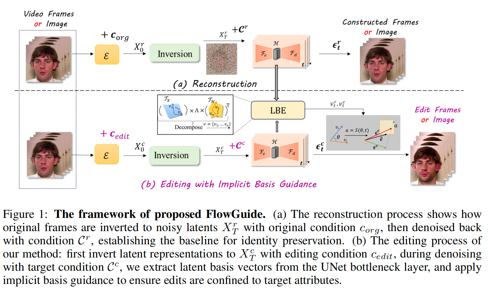
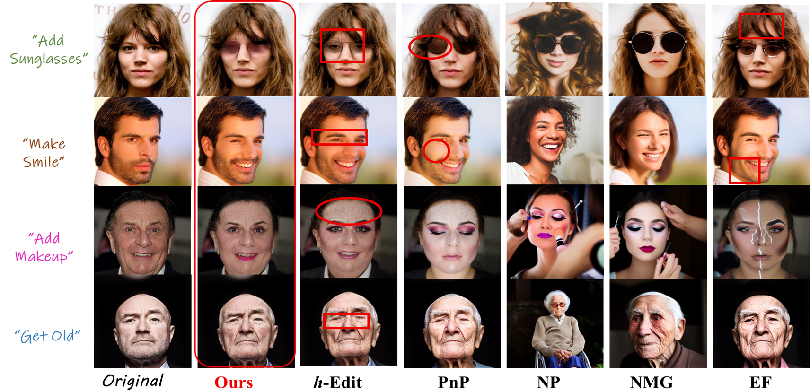
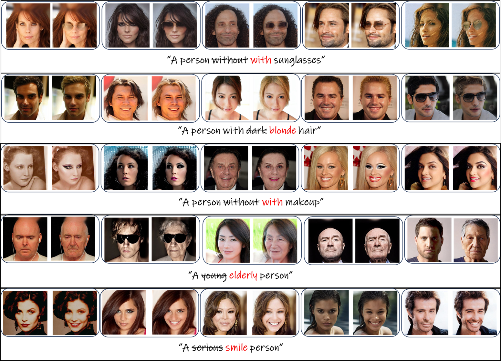
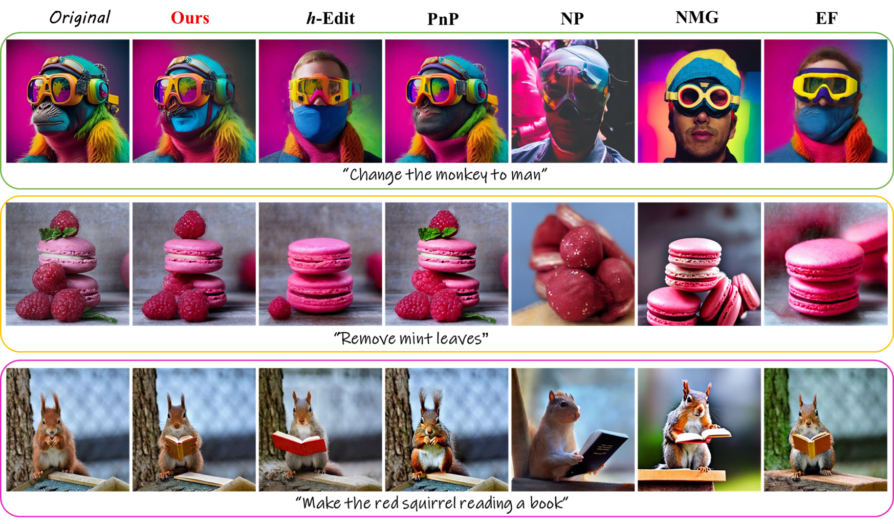
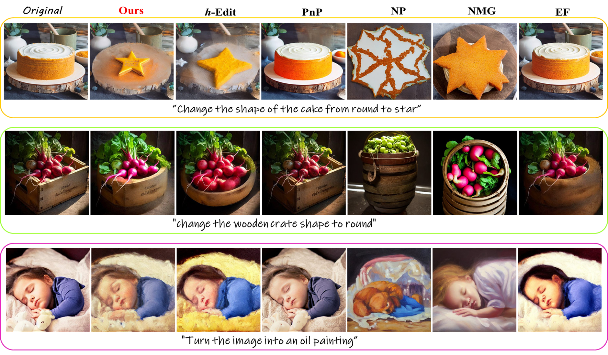
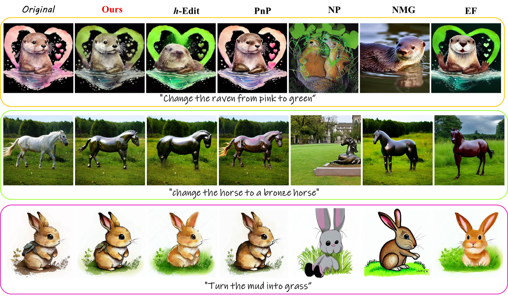

# PIXEL-PERFECT PUPPETRY: PRECISION-GUIDED ENHANCEMENT FOR FACE IMAGE AND VIDEO EDITING (ICLR26)

This project implements **FlowEdit**, our novel diffusion-based editing framework. We leverage h-Edit to obtain reconstruction and editing direction items, while our core algorithm in `inversion/p2p_h_edit.py` introduces a novel masking mechanism that selectively applies editing based on h-space analysis, achieving state-of-the-art performance in both reconstruction fidelity and editing precision.


## Core Algorithm

Our novel FlowEdit algorithm is implemented in `inversion/p2p_h_edit.py` within the `h_Edit_p2p_flowedit_w_guide` function (lines 724-943). While we utilize h-Edit's `local_encoder_pullback_zt` to obtain reconstruction and editing direction items from h-space, our core contribution is the novel masking mechanism that selectively applies editing based on directional analysis in h-space.

### 1. Image Inversion
- **DDIM/DDPM Inversion**: Convert input image to latent noise representation
- **Latent Encoding**: Use VAE to encode image into diffusion latent space
- **Noise Trajectory**: Generate forward diffusion trajectory

### 2. Obtaining Reconstruction and Edit Items via h-Edit
- **Local Encoder Pullback**: Use h-Edit's `local_encoder_pullback_zt` to compute h-space representations
- **Extract Directions**: Obtain reconstruction direction (`rec_term`) and editing direction (`edit_term`)
- **h-Space Analysis**: Compute directional vectors in h-space for both reconstruction and editing

### 3. FlowEdit's Mechanism
- **Directional Analysis**: Compute similarity between reconstruction and editing directions in h-space.

- **Selective Editing**: Apply our novel `diffusion_step` function that selectively combines reconstruction and editing:
  ```python
  mask = diffusion_step(rec_term, edit_term, t=int(tt), prox='l1', quantile=cos_similarity, recon_t=400)
  xt_prev_opt = rec_term + mask * edit_term
  ```
- **Region-Aware Editing**: The mask determines which regions should be edited versus preserved, based on h-space directional alignment

## Key Technical Components

### Using h-Edit for Reconstruction and Edit Items
We utilize h-Edit's established methods to obtain the foundational items for our algorithm:

```python
# Use h-Edit's local_encoder_pullback_zt to get reconstruction direction
_, _, v_orig = model.unet.local_encoder_pullback_zt(
    sample=rec_term.detach(), 
    timesteps=tt, 
    context=text_embeddings[:1].detach(),
    op='mid', block_idx=0, pca_rank=1, ...
)

# Use h-Edit's local_encoder_pullback_zt to get editing direction  
_, _, v_edit = model.unet.local_encoder_pullback_zt(
    sample=edit_term.detach(), 
    timesteps=tt, 
    context=text_embeddings[1:].detach(),
    op='mid', block_idx=0, pca_rank=1, ...
)
```

### FlowEdit's Novel Masking Algorithm
Our core innovation is the selective editing mechanism based on h-space directional analysis:

- **Cosine Similarity Computation**: Analyze alignment between reconstruction and editing directions
  ```python
  cos_similarity = cal_cosine(v_edit, v_orig)
  ```
- **Adaptive Masking**: Generate edit/preserve masks based on directional similarity
  ```python
  mask = diffusion_step(rec_term, edit_term, t=int(tt), prox='l1', quantile=cos_similarity)
  ```
- **Selective Update**: Apply editing only to regions where directions align
  ```python
  xt_prev_opt = rec_term + mask * edit_term
  ```

## Usage

### Environment Setup
```bash
# Create conda environment
conda env create -f environment_p2p.yaml

# Install CLIP
pip install --no-cache-dir git+https://github.com/openai/CLIP.git
```

### Running FlowEdit

Execute our implementation via `main_flowedit.py`, which calls our novel algorithm in `inversion/p2p_h_edit.py`:

```bash
# Run FlowEdit-R with P2P (recommended configuration)
python main_flowedit.py \
    --implicit \
    --optimization_steps 1 \
    --weight_reconstruction 0.3 \
    --cfg_src 1.0 \
    --cfg_src_edit 5.0 \
    --cfg_tar 7.5 \
    --xa 0.4 \
    --sa 0.35
```

**Note**: The entry point is `main_flowedit.py`, but our novel masking algorithm is implemented in `inversion/p2p_h_edit.py` within the `h_Edit_p2p_flowedit_w_guide` function.

## Parameters

### Guidance Parameters

| Parameter | Type | Default | Description |
|-----------|------|---------|-------------|
| `--cfg_src` | `float` | `1.0` | Classifier-free guidance for source prompt |
| `--cfg_src_edit` | `float` | `5.0` | Source edit guidance ($\hat{w}^{orig}$) |
| `--cfg_tar` | `float` | `7.5` | Target edit guidance ($w^{edit}$) |

### P2P Attention Control Parameters

| Parameter | Type | Default | Description |
|-----------|------|---------|-------------|
| `--xa` | `float` | `0.4` | Cross-attention control strength |
| `--sa` | `float` | `0.35` | Self-attention control strength (0.6 for h-Edit-D, 0.35 for h-Edit-R) |

### Diffusion Parameters

| Parameter | Type | Default | Description |
|-----------|------|---------|-------------|
| `--num_diffusion_steps` | `int` | `50` | Number of diffusion steps |
| `--skip` | `int` | `0` | Steps to skip in early diffusion |
| `--eta` | `float` | `1.0` | DDPM stochasticity (0.0 for deterministic) |

## Best Practices

### Parameter Tuning
FlowEdit uses these parameters from `main_flowedit.py` to control the editing process:
1. **`--cfg_src_edit` and `--cfg_tar`: Control classifier-free guidance strengths for computing edit directions. These affect the `edit_term` in your masking algorithm.
2. **`--optimization_steps`**: Number of iterative refinement steps (default: 1)
3. **`--eta`**: DDPM stochasticity (1.0 for FlowEdit-R, 0.0 for FlowEdit-D)

### Tuning FlowEdit's Mechanism
- **Region-aware editing**: The `diffusion_step` function uses cosine similarity between recon and edit directions in h-space to determine editing regions
- **Threshold adjustment**: Adjust the `quantile` parameter in masking to control how aggressively editing is applied (higher = more conservative)
- **Temporal consistency**: For video editing, the masking naturally preserves identity across frames better than global editing approaches

### Attention Control
- **P2P recommended** for text-guided editing
- **Fine-tune `xa` and `sa`** based on edit complexity
- **Global edits**: May need preprocessing for blend words

## Results and Performance

### Image Editing Results

FlowEdit achieves state-of-the-art performance on image editing tasks, surpassing previous diffusion-based editing approaches in both reconstruction fidelity and editing accuracy.











### Video Editing Results

Our method demonstrates superior performance on video editing tasks compared to existing approaches (LatentTrans, STIT, DVA).

#### Add Mustache - Non-paste-back Comparison

<div align="center">
  <table>
    <tr>
      <th style="text-align: center">Original Video</th>
      <th style="text-align: center">LatentTrans</th>
      <th style="text-align: center">STIT</th>
      <th style="text-align: center">DVA</th>
      <th style="text-align: center">FlowEdit (Ours)</th>
    </tr>
    <tr>
      <td>
        <video width="240px" controls>
          <source src="assets/video_comprison/origin_crop.mp4" type="video/mp4">
        </video>
      </td>
      <td>
        <video width="240px" controls>
          <source src="assets/video_comprison/latent_mustache_crop.mp4" type="video/mp4">
        </video>
      </td>
      <td>
        <video width="240px" controls>
          <source src="assets/video_comprison/stit_mustache_crop.mp4" type="video/mp4">
        </video>
      </td>
      <td>
        <video width="240px" controls>
          <source src="assets/video_comprison/dva_mustache_crop.mp4" type="video/mp4">
        </video>
      </td>
      <td>
        <video width="240px" controls>
          <source src="assets/video_comprison/our_mustache1_crop.mp4" type="video/mp4">
        </video>
      </td>
    </tr>
  </table>
</div>

#### Add Mustache - Paste-back Comparison

<div align="center">
  <table>
    <tr>
      <th style="text-align: center">Original Video</th>
      <th style="text-align: center">LatentTrans</th>
      <th style="text-align: center">STIT</th>
      <th style="text-align: center">DVA</th>
      <th style="text-align: center">FlowEdit (Ours)</th>
    </tr>
    <tr>
      <td>
        <video width="240px" controls>
          <source src="assets/video_comprison/origin_full.mp4" type="video/mp4">
        </video>
      </td>
      <td>
        <video width="240px" controls>
          <source src="assets/video_comprison/latent_mustache.mp4" type="video/mp4">
        </video>
      </td>
      <td>
        <video width="240px" controls>
          <source src="assets/video_comprison/stit_mustache.mp4" type="video/mp4">
        </video>
      </td>
      <td>
        <video width="240px" controls>
          <source src="assets/video_comprison/dva_mustache.mp4" type="video/mp4">
        </video>
      </td>
      <td>
        <video width="240px" controls>
          <source src="assets/video_comprison/our_mustache1.mp4" type="video/mp4">
        </video>
      </td>
    </tr>
  </table>
</div>

#### Add Lipstick - Non-paste-back Comparison

<div align="center">
  <table>
    <tr>
      <th style="text-align: center">Original Video</th>
      <th style="text-align: center">LatentTrans</th>
      <th style="text-align: center">STIT</th>
      <th style="text-align: center">DVA</th>
      <th style="text-align: center">FlowEdit (Ours)</th>
    </tr>
    <tr>
      <td>
        <video width="240px" controls>
          <source src="assets/video_comprison/origin_crop.mp4" type="video/mp4">
        </video>
      </td>
      <td>
        <video width="240px" controls>
          <source src="assets/video_comprison/latent_lipstick_crop.mp4" type="video/mp4">
        </video>
      </td>
      <td>
        <video width="240px" controls>
          <source src="assets/video_comprison/stit_lipstick_crop.mp4" type="video/mp4">
        </video>
      </td>
      <td>
        <video width="240px" controls>
          <source src="assets/video_comprison/dva_lipstick_crop.mp4" type="video/mp4">
        </video>
      </td>
      <td>
        <video width="240px" controls>
          <source src="assets/video_comprison/our_lipstick2_crop.mp4" type="video/mp4">
        </video>
      </td>
    </tr>
  </table>
</div>

#### Add Lipstick - Paste-back Comparison

<div align="center">
  <table>
    <tr>
      <th style="text-align: center">Original Video</th>
      <th style="text-align: center">LatentTrans</th>
      <th style="text-align: center">STIT</th>
      <th style="text-align: center">DVA</th>
      <th style="text-align: center">FlowEdit (Ours)</th>
    </tr>
    <tr>
      <td>
        <video width="240px" controls>
          <source src="assets/video_comprison/origin_full.mp4" type="video/mp4">
        </video>
      </td>
      <td>
        <video width="240px" controls>
          <source src="assets/video_comprison/latent_lipstick.mp4" type="video/mp4">
        </video>
      </td>
      <td>
        <video width="240px" controls>
          <source src="assets/video_comprison/stit_lipstick.mp4" type="video/mp4">
        </video>
      </td>
      <td>
        <video width="240px" controls>
          <source src="assets/video_comprison/dva_lipstick.mp4" type="video/mp4">
        </video>
      </td>
      <td>
        <video width="240px" controls>
          <source src="assets/video_comprison/our_lipstick2.mp4" type="video/mp4">
        </video>
      </td>
    </tr>
  </table>
</div>

### Different Edits on the Same Subject

<table class="center">
  <tr>
    <td style="text-align: center"><b>Original Video</b></td>
    <td style="text-align: center"><b>Add Mustache</b></td>
    <td style="text-align: center"><b>Keep Smile</b></td>
    <td style="text-align: center"><b>Keep Mouth Open</b></td>
  </tr>
  <tr>
    <td style="text-align: center"></a></td>
    <td style="text-align: center"></a></td>
    <td style="text-align: center"></a></td>
    <td style="text-align: center"></a></td>
  </tr>
  <tr>
    <td style="text-align: center"></a></td>
    <td style="text-align: center"></a></td>
    <td style="text-align: center"></a></td>
    <td style="text-align: center"></a></td>
  </tr>
  <tr>
    <td style="text-align: center"></a></td>
    <td style="text-align: center"></a></td>
    <td style="text-align: center"></a></td>
    <td style="text-align: center"></a></td>
  </tr>
</table>

### Output

Edited frames are saved in the directory specified by `--output_path` with the following naming convention:
- `{index:04d}_orig_{source_prompt}_edit_{target_prompt}_...`
- Reconstruction files: `{index:04d}_reconstruct_...`

### Key Advantages

1. **Simultaneous Reconstruction and Editing**: FlowEdit uses h-Edit to obtain recon/edit items, then applies our novel masking to optimize both objectives simultaneously.

2. **Region-Aware Editing**: Our cosine similarity-based masking applies editing only to relevant regions, preserving identity better than global editing.

3. **Superior Video Editing**: FlowEdit maintains temporal consistency and identity preservation better than LatentTrans, STIT, and DVA baselines.


## Acknowledgments

Our FlowEdit method utilizes h-Edit's `local_encoder_pullback_zt` for obtaining reconstruction and editing direction items from h-space. Our novel contribution is the masking algorithm that selectively applies editing based on h-space directional analysis. We also acknowledge:

- [h-Edit](https://arxiv.org/pdf/2503.02187) - We use h-Edit's h-space computation (`local_encoder_pullback_zt`) to obtain reconstruction and editing items
- [Edit Friendly](https://github.com/inbarhub/DDPM_inversion) - DDPM inversion techniques
- [PnP Inversion](https://github.com/cure-lab/PnPInversion/) - Inversion and attention control
- [Noise Map Guidance](https://github.com/hansam95/NMG) - Noise-guided editing
- [Prompt-to-Prompt](https://github.com/google/prompt-to-prompt) - Attention-based editing

## Citation

If you use this code in your research, please cite our paper:


```bibtex
@inproceedings{pixelperfect2026,
  title={Pixel-Perfect Puppetry: Precision-Guided Enhancement for Face Image and Video Editing},
  author={Li, Yan and Wang, Zhenyi and Li, Guanghao and Xue, Wei and Luo, Wenhan and Guo, Yike},
  booktitle={International Conference on Learning Representations (ICLR)},
  year={2026}
}
```


## Contact

Feel free to open an issue on the repository or send an email.
